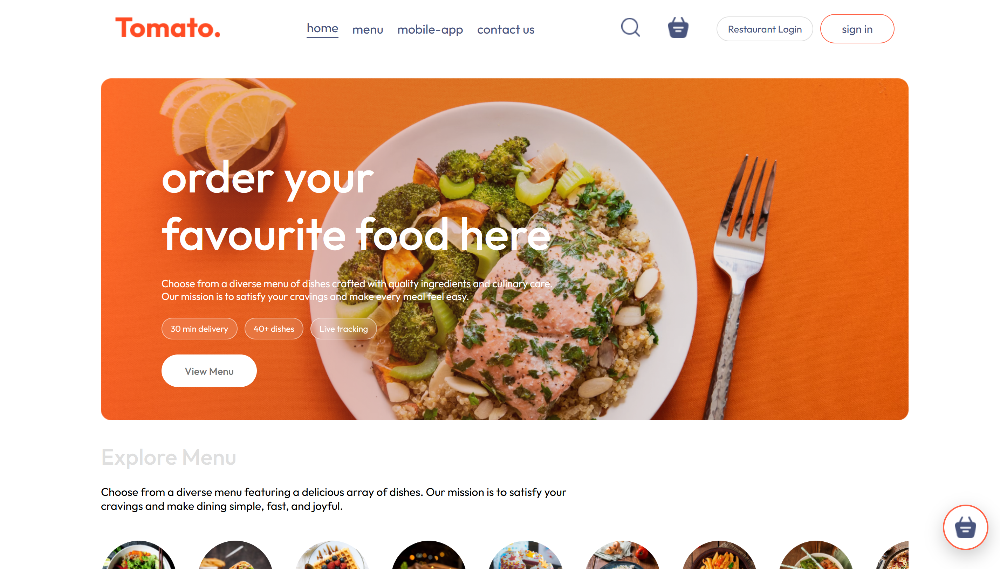
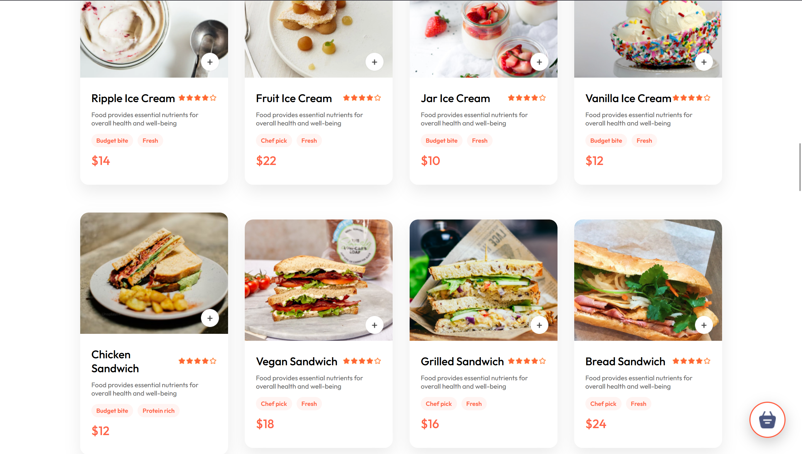
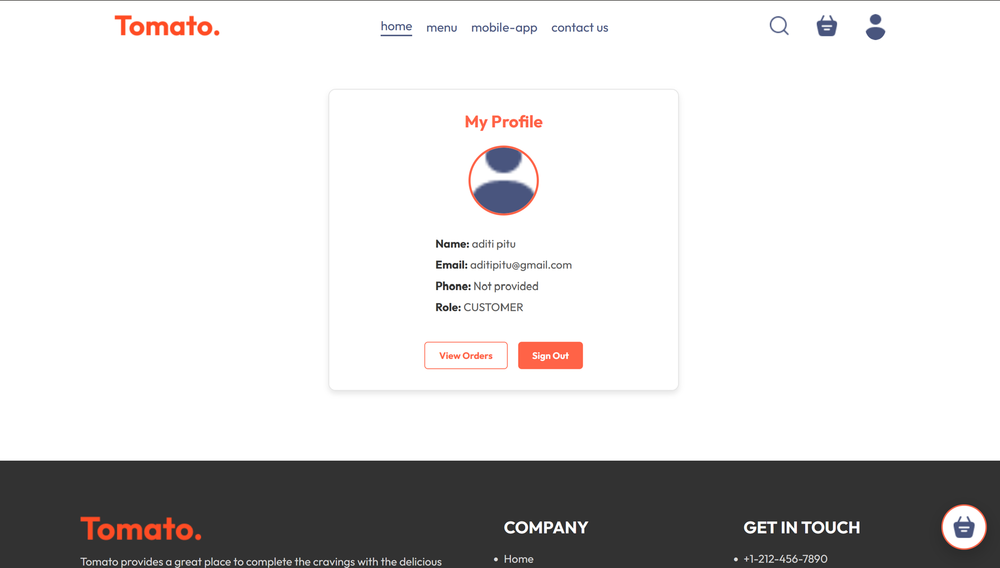
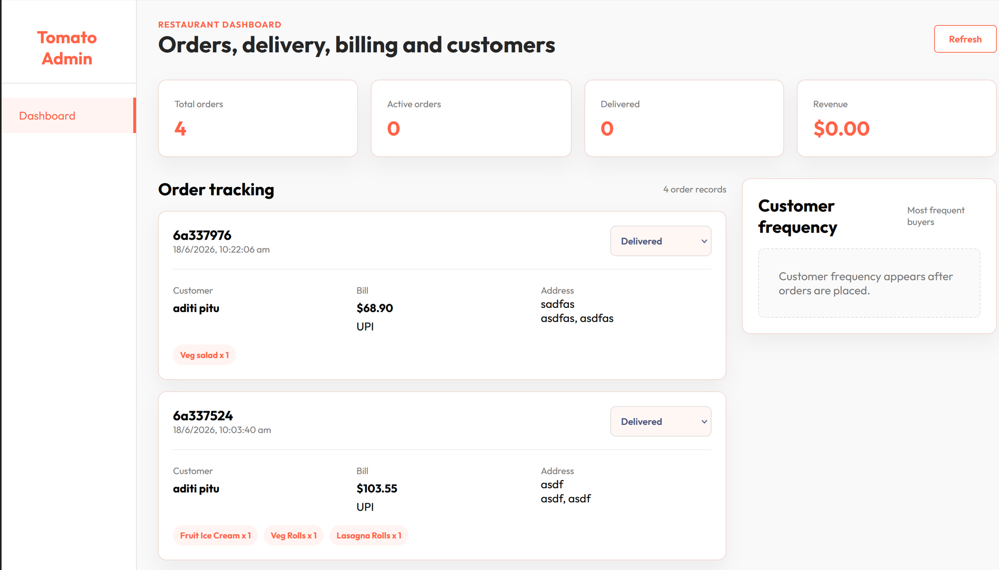
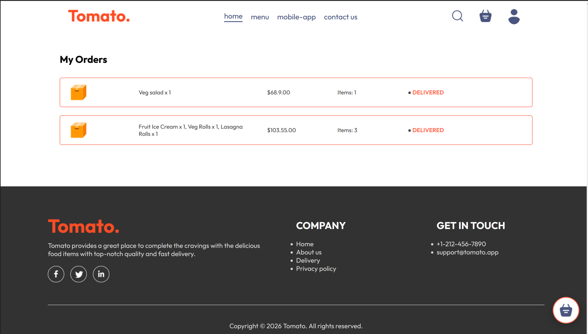

# Tomato. - Food Delivery Web App 🍅

A full-stack, production-ready food delivery application built with the MERN stack (MongoDB, Express, React, Node.js) and Socket.io for real-time order tracking.

## 📸 Screenshots

### Home Page

*A beautiful landing page to welcome users and showcase the menu.*

### Food Menu

*Browse through a diverse menu of delicious dishes.*

### User Profile

*User dashboard to manage profile details and view order history.*

### Admin Dashboard

*A comprehensive dashboard for restaurant owners to manage orders, track revenue, and monitor deliveries.*

### My Orders

*Track the status of your current and past orders.*

## ✨ Features

* **User Authentication:** Secure login and registration using JWT.
* **Browse & Order:** View restaurant menus, add items to the cart, and place orders.
* **Real-Time Tracking:** Track order status in real-time (Preparing, Out for Delivery, Delivered) powered by Socket.io.
* **Admin/Restaurant Dashboard:** Manage incoming orders, update statuses, and view revenue analytics.
* **Responsive Design:** A beautiful UI that works perfectly on desktop and mobile devices.

## 🛠️ Tech Stack

* **Frontend:** React (Vite), React Router, Context API
* **Backend:** Node.js, Express.js
* **Database:** MongoDB, Mongoose
* **Real-time:** Socket.io
* **Authentication:** JSON Web Tokens (JWT), bcryptjs
* **Image Hosting:** Cloudinary

